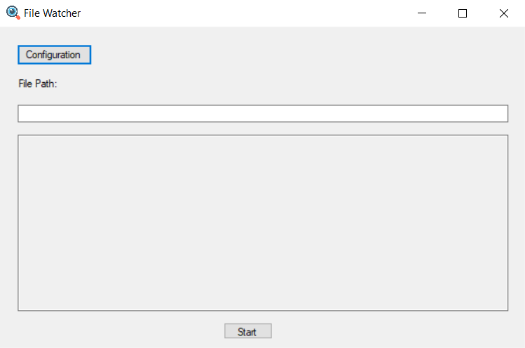

# File Watcher

File Watcher is a Windows Forms application developed in C# that facilitates real-time monitoring of file changes and automated copying to a designated destination path.

## Features

- **File Monitoring:** Utilizes the `FileSystemWatcher` class to track changes in a specified file, triggering immediate copying to the configured destination path.
- **Configuration:** Allows users to conveniently set the destination path through an intuitive configuration form (`ConfigFrm`) included in the application.
- **Error Handling:** Implements basic validation to ensure entered paths are valid directories or files, providing informative messages for incorrect entries.

## Usage

1. **Launching the Application:** Run the main executable to open the File Watcher interface (`Form1`).
2. **Configuring Destination Path:** Access the configuration form (`ConfigFrm`) to set the desired destination folder where modified files will be copied.
3. **Start/Stop Watching:** Use the provided interface to start or stop the file monitoring process.

## Requirements

- Windows operating system
- .NET Framework

## How to Run

1. Clone or download the repository.
2. Open the solution file in Visual Studio.
3. Build and run the project.

## Contributing

Contributions are welcome! Fork the repository, make changes, and create a pull request. For major modifications, please open an issue first to discuss the changes.

## License

This project is licensed under the [MIT License](LICENSE).